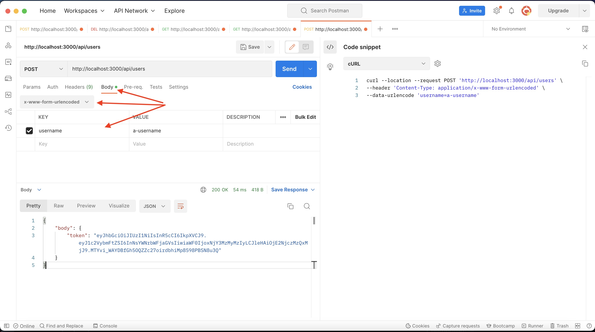
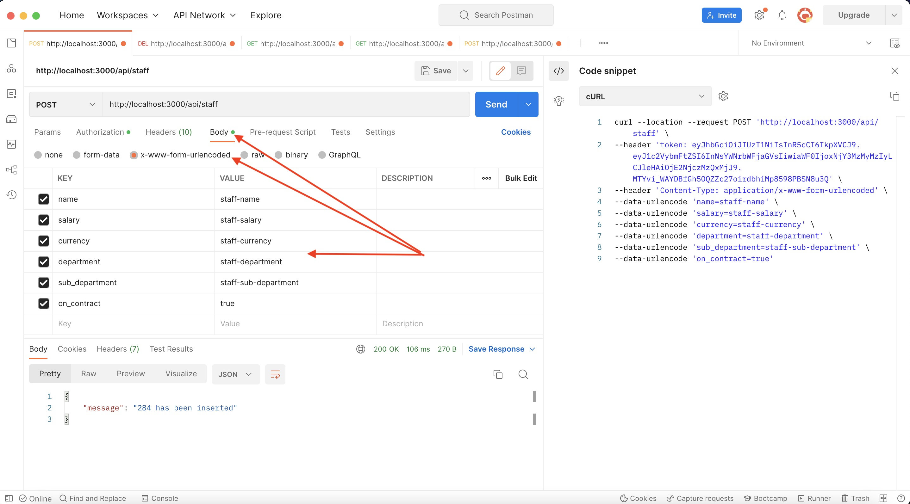
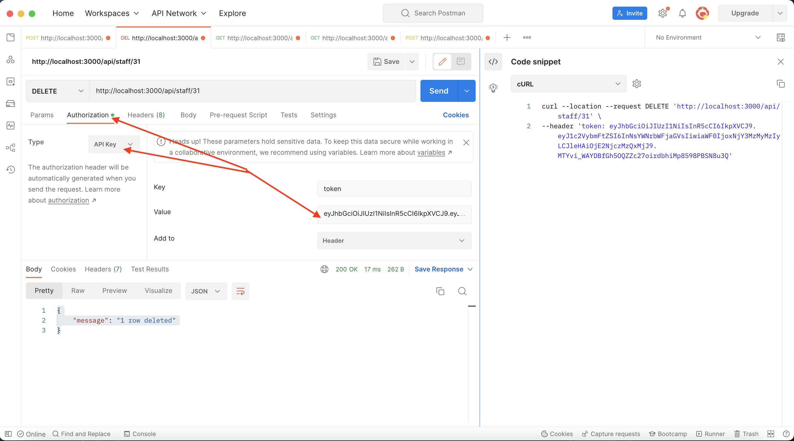
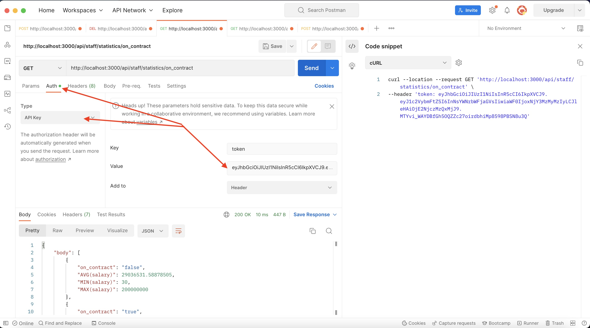
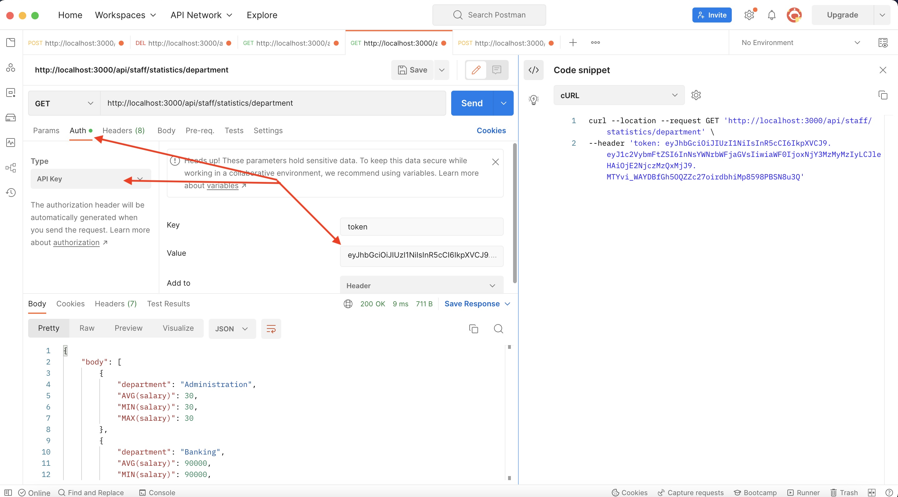
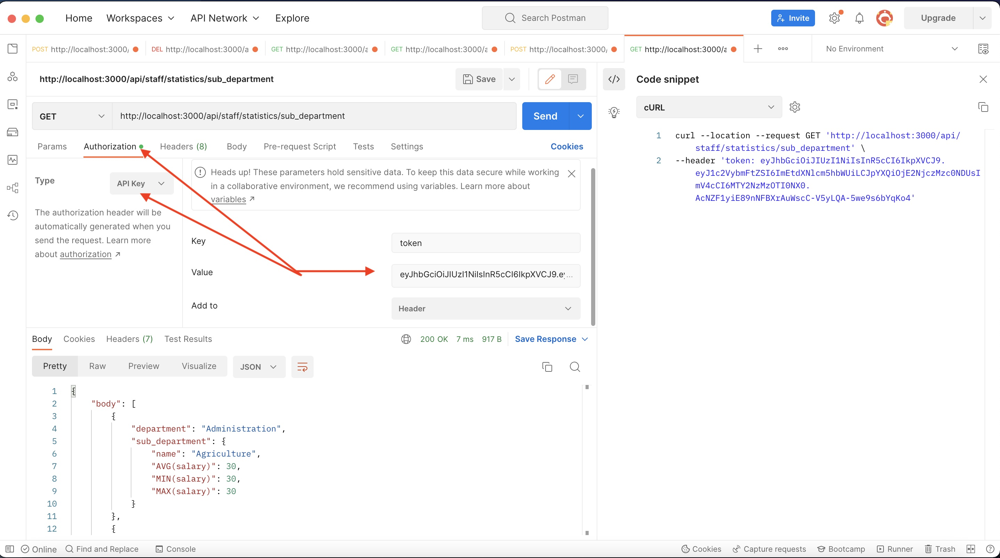

# api-with-sqlite

node express api using a sqlite in memory database

## Overview

This repository is a basic application that demonstartes how to create a sqlite powered api.

### Technologies

- Javascript (ES6+)
- Nodejs (v14.x)
- Express
- Jest
- Supertest
- SqLite
- JSON web token
- Docker

## Running the App locally

Clone the repository to your workspace and open the codebase in an IDE of your choice.

```
git clone https://github.com/armakuni/nodejs-intro-to-devops-workshop.git
```

or

```
git clone https://github.com/machelslack/api-with-sqlite.git
```

git@github.com:machelslack/api-with-sqlite.git

### Running a container using a Docker image

From the root of the project cd into staff directory.

There run command docker compose up.

Which will create and start a container using the app image built from the definitions in Dockerfile.

With the container now running you should be able to interact with the app using local post 3000 - http://localhost:3000

http://localhost:3000/

### Stopping the Container

You can stop the container by using

```
docker compose down
```

The app exposes 6 endpoints which can either be tested using CLI utility [curl](https://curl.se/), [Postman](https://www.postman.com/downloads/)

- A `GET` on `http://localhost:3000/` which returns a simple HTML page with a `Welcome to Express` text in the body if successful.

  To test the application on your browser, click on the link below while running the image in a container
  http://localhost:3000

- A `POST` on `/api/users` expects a x-www-form-urlencoded body containing the username to authroize, and will return token to be used in subsequent API requests

  ```
  curl -X POST http://localhost:3000/api/users
   -H "Content-Type: application/x-www-form-urlencoded"
   -d "username=value"
  ```

  using POSTMAN
  

  Expected Output:

  ```json
  {
    "body": {
      "token": "token-value"
    }
  }
  ```

- A `POST` on `/api/staff` expects a x-www-form-urlencoded body containing the staff values to enter into the database

  ```
  curl --location --request POST 'http://localhost:3000/staff' \
  --header 'token: << your api token >>' \
  --header 'Content-Type: application/x-www-form-urlencoded' \
  --data-urlencode 'name=<< SOME VALUE>>' \
  --data-urlencode 'salary=<< SOME VALUE>>' \
  --data-urlencode 'currency=<< SOME VALUE>>' \
  --data-urlencode 'department=<< SOME VALUE>>' \
  --data-urlencode 'sub_department=<< SOME VALUE>>' \
  --data-urlencode 'on_contract=<< true or false>>'
  ```

  using POSTMAN
  

  Expected Output:

  ```json
  {
    "message": "<<ID OF NEW RECORD>> has been inserted"
  }
  ```

- A `DELETE` on `/api/staff/<<staff-id>>` expects a url containing the id of the staff to delete

  ```
  curl --location --request DELETE 'http://localhost:3001/api/staff/1' \
  --header 'token: << your api token >>'
  ```

  using POSTMAN
  

  Expected Output:

  ```json
  {
    "message": "<<ID OF RECORD>> row deleted"
  }
  ```

  - A `GET` on `/statistics/on_contract` which returns a json object of mean min and max salaries of on contract staff grouped by department

  ```
  curl --location --request GET 'http://localhost:3000/api/staff/statistics/on_contract' \
  --header 'token: << your api token >>' \
  ```

using POSTMAN


Expected Output:

```json
{
  "body": [
      {
          "on_contract": "false",
          "AVG(salary)": <<some value>>,
          "MIN(salary)": <<some value>>,
          "MAX(salary)": <<some value>>,
      },
      {
          "on_contract": "true",
          "AVG(salary)": <<some value>>,
          "MIN(salary)": <<some value>>,
          "MAX(salary)": <<some value>>,
      }
  ]
}
```

- A `GET` on `/statistics/department` which returns a json object of mean min and max salaries grouped by department

```
 curl --location --request GET 'http://localhost:3000/api/staff/statistics/department' \
--header 'token: << your api token >>' \
```

using POSTMAN


Expected Output:

```json
{
  "body": [
    {
      "department": "Administration",
      "AVG(salary)": <<some value>>,
      "MIN(salary)": <<some value>>,
      "MAX(salary)": <<some value>>,
    },
    {
      "department": "Banking",
      "AVG(salary)": <<some value>>,
      "MIN(salary)": <<some value>>,
      "MAX(salary)": <<some value>>,
    },
    {
      "department": "Engineering",
      "AVG(salary)": <<some value>>,
      "MIN(salary)": <<some value>>,
      "MAX(salary)": <<some value>>,
    },
    {
      "department": "Operations",
      "AVG(salary)": <<some value>>,
      "MIN(salary)": <<some value>>,
      "MAX(salary)": <<some value>>,
    }
  ]
}
```

- A `GET` on `/statistics/sub_department` which returns a json object of mean min and max salaries for sub departments grouped by department

```
curl --location --request GET 'http://localhost:3000/api/staff/statistics/sub_department' \
--header 'token: << your api token >>' \
```

using POSTMAN


Expected Output Format:

```json
{
  "body": {
    "department": {
      "sub_department": {
        "name": <<some name>>,
        "AVG(salary)": <<some value>>,
        "MIN(salary)": <<some value>>,
        "MAX(salary)": <<some value>>,
      }
    }
  }
}
```

```

```
